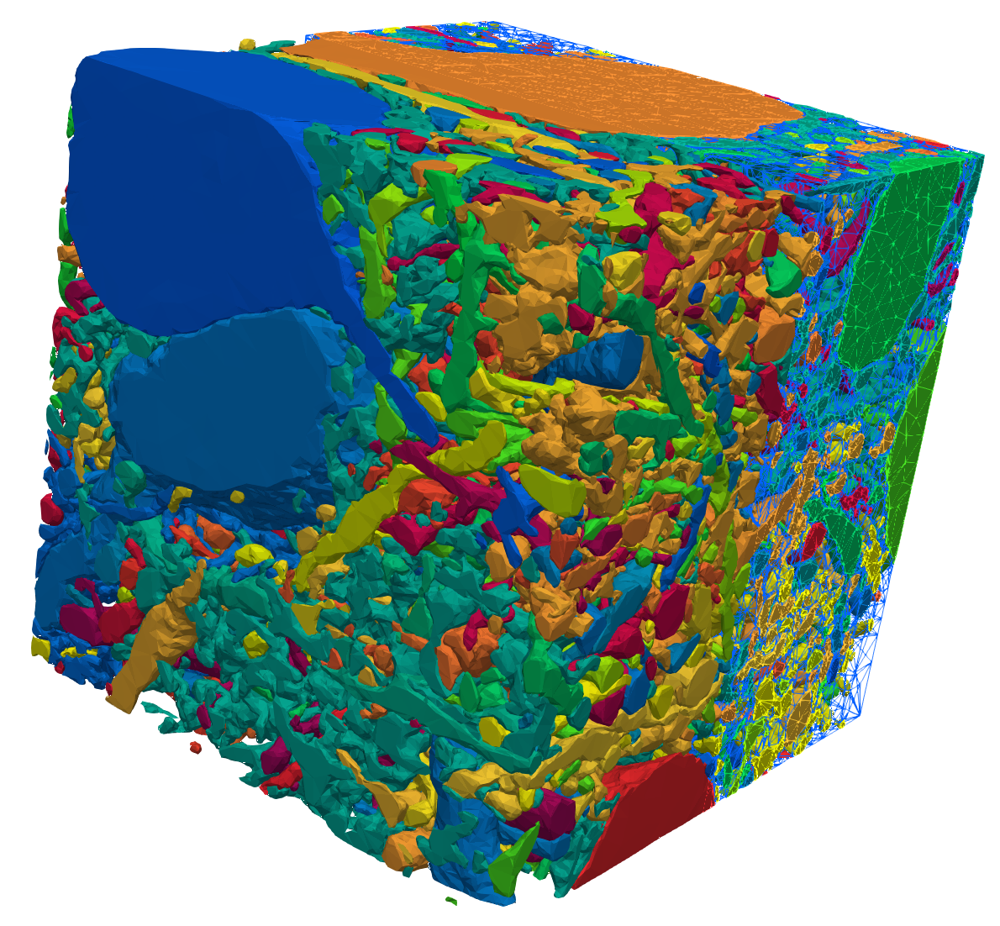

# EMI-Mesh: Generating high-quality extracellular-membrane-intracellular meshes from imaging data




This repo provides a pipeline to generate high quality tetrahedral meshes of brain tissue on the cellular scale suitable for numerical simulations.

## Features:

- high quality meshes of dense reconstructions of the neuropil
- both extracellular and intracellular space included
- automated pipeline from segmentation to mesh
- basic image processing steps included, to account for e.g. missing ECS from chemically fixated tissue

## Install Snakemake

`mamba create -c conda-forge -c bioconda -n snakemake snakemake snakemake-storage-plugin-http snakemake-executor-plugin-cluster-generic`

## Workflow
- choose your dataset, position and size, e.g. using  [neuroglancer](https://github.com/google/neuroglancer/) (example: cortical MM^3 dataset at position [225182-107314-22000](https://ngl.microns-explorer.org/#!%7B%22dimensions%22:%7B%22x%22:%5B4e-9%2C%22m%22%5D%2C%22y%22:%5B4e-9%2C%22m%22%5D%2C%22z%22:%5B4e-8%2C%22m%22%5D%7D%2C%22position%22:%5B225182.5%2C107314.5%2C22000.5%5D%2C%22crossSectionScale%22:11.406101410482504%2C%22projectionOrientation%22:%5B0.1528419554233551%2C0.49656152725219727%2C0.39075320959091187%2C0.7598538994789124%5D%2C%22projectionScale%22:40961.499900183306%2C%22layers%22:%5B%7B%22type%22:%22image%22%2C%22source%22:%7B%22url%22:%22precomputed://https://bossdb-open-data.s3.amazonaws.com/iarpa_microns/minnie/minnie65/em%22%2C%22subsources%22:%7B%22default%22:true%7D%2C%22enableDefaultSubsources%22:false%7D%2C%22tab%22:%22source%22%2C%22annotationColor%22:%22#7d7d7d%22%2C%22shaderControls%22:%7B%22normalized%22:%7B%22range%22:%5B86%2C172%5D%7D%7D%2C%22name%22:%22img%22%7D%2C%7B%22type%22:%22segmentation%22%2C%22source%22:%7B%22url%22:%22precomputed://gs://iarpa_microns/minnie/minnie65/seg%22%2C%22subsources%22:%7B%22default%22:true%2C%22mesh%22:true%7D%2C%22enableDefaultSubsources%22:false%7D%2C%22tab%22:%22segments%22%2C%22annotationColor%22:%22#949494%22%2C%22selectedAlpha%22:0.3%2C%22segments%22:%5B%22864691134947427836%22%2C%22864691135337771494%22%2C%22864691135393949941%22%2C%22864691135462270365%22%2C%22864691135474669888%22%2C%22864691135617729935%22%2C%22864691135718476593%22%2C%22864691136024102713%22%2C%22864691136390364287%22%2C%22864691136436690846%22%5D%2C%22segmentQuery%22:%22864691136194301772%2C%20864691136814938734%22%2C%22colorSeed%22:3728349837%2C%22name%22:%22seg%22%7D%5D%2C%22showAxisLines%22:false%2C%22showSlices%22:false%2C%22selectedLayer%22:%7B%22visible%22:true%2C%22layer%22:%22seg%22%7D%2C%22layout%22:%7B%22type%22:%224panel%22%2C%22orthographicProjection%22:true%7D%2C%22selection%22:%7B%22layers%22:%7B%22seg%22:%7B%22annotationId%22:%22data-bounds%22%2C%22annotationSource%22:0%2C%22annotationSubsource%22:%22bounds%22%7D%7D%7D%7D))
- download segmented image data
- preprocess the image for meshing
    - choose *N* largest cells
    - expand, apply morphological smoothing and shrinkage/erosion to each cell
- extract the surfaces of each cell
- generate a volumetric mesh of the extracted surfaces mesh and the extracellular space in between the cells with [fTetWild](https://github.com/wildmeshing/fTetWild)

## Reproducing results

The workflow is based on [Snakemake](https://snakemake.readthedocs.io/en/stable/index.html). To generate meshes, install snakemake (e.g. `conda install -c bioconda snakemake`), modify the `config.yml` file in this repo and run `snakemake --cores all --use-conda`. That's it!
`Snakemake` will install all required dependencies (specified in `workflow/envs/environment.yml`) and orchastrate the jobs. It also supports schedulers on HPC systems such as slurm.

## Output
The output consists of the following directories:
* raw: The downloaded segmentation as is in `.vtk` format, suitable for e.g. paraview
* processed: The processed image in `.vtk` format
* surfaces: The surfaces of the extracted cells in `.ply` format, again suitable for visualization with paraview or usage in other meshing software
* meshes: The generated volumetric meshes in `.xdmf` format, containing labels for the extracellular space (label 1) and increasing integer values (2,..., N) for all cells. There is currently no mapping to the cell ids of the segmentation. The file `_facet.xdmf`contains facet marker, where the label *l* corresponds to the boundary between ECS and cell *l*. The outer boundaries are marked as `l + offset`, where `offset` is the next higher power of ten of the  number of cells (`offset=int(10 ** np.ceil(np.log10(N_cells)))`)

## Read the mesh with FEniCS

The meshes are ready for usage with FEniCS:
```
from fenics import *
import numpy as np

mesh = Mesh()
infile = XDMFFile("mesh.xdmf")
infile.read(mesh)
gdim = mesh.geometric_dimension()
labels = MeshFunction("size_t", mesh, gdim)
infile.read(labels, "label")
infile.close()

# get all local labels
np.unique(labels.array())
# array([ 1,  2,  3,  4,  5,  6,  7,  8,  9, 10, 11], dtype=uint64)

infile = XDMFFile("facets.xdmf")
infile.read(mesh)
gdim = mesh.geometric_dimension()
boundary_marker = MeshFunction("size_t", mesh, gdim - 1)
infile.read(boundary_marker, "boundaries")
infile.close()

# get all local facet labels
np.unique(boundary_marker.array())
# array([  0,   1,   2,   3,   4,   5,   6,   7,   9,  10,  11, 101, 102,
#          103, 104, 105, 106, 107, 108, 109, 110, 111], dtype=uint64)
```

## Limitations
* currently only supports data accessible via [cloud-volume](https://github.com/seung-lab/cloud-volume)
* assumes isotropic data
* does not handle intersecting cells
* agnostic to cell types - all cells are handled equal


